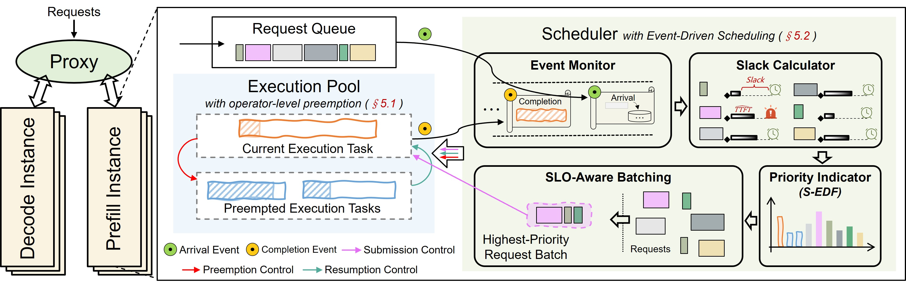

# FlowPrefill: Decoupling Preemption from Prefill Scheduling Granularity to Mitigate Head-of-Line Blocking in LLM Serving [[paper](https://arxiv.org/abs/2602.16603)]

## Abstract
The growing demand for large language models (LLMs) requires serving systems to handle many concurrent requests with diverse service level objectives (SLOs). This exacerbates head-of-line (HoL) blocking during the compute-intensive prefill phase, where long-running requests monopolize resources and delay higher-priority ones, leading to widespread time-to-first-token (TTFT) SLO violations. While chunked prefill enables interruptibility, it introduces an inherent trade-off between responsiveness and throughput: reducing chunk size improves response latency but degrades computational efficiency, whereas increasing chunk size maximizes throughput but exacerbates blocking. This necessitates an adaptive preemption mechanism. However, dynamically balancing execution granularity against scheduling overheads remains a key challenge.

In this paper, we propose FlowPrefill, a TTFT-goodput-optimized serving system that resolves this conflict by decoupling preemption granularity from scheduling frequency. To achieve adaptive prefill scheduling, FlowPrefill introduces two key innovations: 1) Operator-Level Preemption, which leverages operator boundaries to enable fine-grained execution interruption without the efficiency loss associated with fixed small chunking; and 2) Event-Driven Scheduling, which triggers scheduling decisions only upon request arrival or completion events, thereby supporting efficient preemption responsiveness while minimizing control-plane overhead. Evaluation on real-world production traces shows that FlowPrefill improves maximum goodput by up to 5.6X compared to state-of-the-art systems while satisfying heterogeneous SLOs.

## Architecture (overview)

<p align="center">
  
  <br/>
  <em>Overview of FlowPrefill.</em>
  
</p>

## Environment Setup

Prerequisites
- Python 3.12
- NVIDIA GPU with CUDA recommended

Installation (CUDA)
```shell
conda create -n flowprefill python=3.12
conda activate flowprefill
uv pip install -r requirements/build.txt
uv pip install -r requirements/common.txt
pip install -e .
```

## Getting Start

#### Trace generation

We sample a trace from [QwenTrace](https://github.com/alibaba-edu/qwen-bailian-usagetraces-anon/blob/main/qwen_traceA_blksz_16.jsonl). The `lower` and `upper` parameters define the lower and upper bounds of the time span (in minutes). The trace is built using the following command:

```shell
python trace_build/trace.py --lower 0 --upper 2
```

#### Profiling
Perform profiling and fit a TTFT prediction model.

```shell
DO_PROFILING=1 bash run_serve.sh
```

#### Run server
```shell
bash run_serve.sh
```

#### Run benchmark
```shell
python benchmarks/benchmark_online.py --model <MODEL_PATH> --rate-scale 1.0 --trace-path trace_build/qwen_traceA_0.0min_2.0min.jsonl
```

## Note
- The code related to the PD-colocation setup and baselines used in the paper is not included in this repository, as it is only used for experimental evaluation in the paper.
- The system currently supports only the NIXL connector for KV transfer.

## Citation
```
@misc{hsieh2026flowprefilldecouplingpreemptionprefill,
      title={FlowPrefill: Decoupling Preemption from Prefill Scheduling Granularity to Mitigate Head-of-Line Blocking in LLM Serving}, 
      author={Chia-chi Hsieh and Zan Zong and Xinyang Chen and Jianjiang Li and Jidong Zhai and Lijie Wen},
      year={2026},
      eprint={2602.16603},
      archivePrefix={arXiv},
      primaryClass={cs.DC},
      url={https://arxiv.org/abs/2602.16603}, 
}
```
